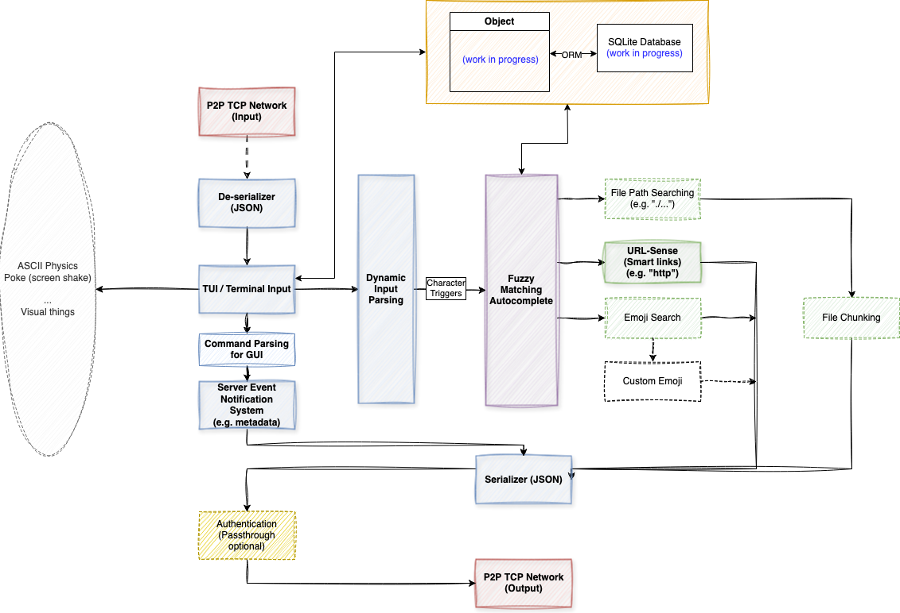
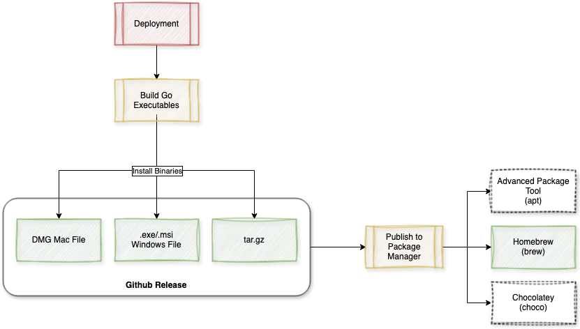

# Bokkoli: A Veggie-to-Veggie Messaging CLI App 🌱

Forked version of Bokkoli to further advance the feature set and complete more future work.

Bokkoli is a peer-to-peer **TCP messaging CLI application** built with **Go**, the **Bubbletea** framework, and **SQLite** for message persistence. The name "Bokkoli" is a playful fusion of "broccoli" and "보끔" (boggeum), the Korean word for "mix," reflecting its nature as a blend of technologies.

This lightweight chat application enables **real-time, direct peer-to-peer communication** through a clean, terminal-based interface. Users can easily connect and exchange messages using the TCP protocol, while **SQLite** ensures that conversation history is safely stored locally.

---

## Technologies Used

**Go** for the backend and message handling.

  

**SQLite** database for persistent local message storage.

  

**Bubbletea** for the TUI framework to create a clean terminal interface.

---

## Wireframe

Here’s a look at the design architecture:

**Internal Design:**  

**Deployment Flow:**  

---

### Planned Features 🚀:

- [ ] **Fuzzy Matching**
- [ ] **Questions, Comments, and Suggestion Forum** within the app
- [ ] **Peer Authentication**
- [ ] **Handshake Protocol**
- [ ] **Message Integrity**
  - [ ] Checksums
  - [ ] Digital Signatures
- [ ] **Encryption and Security**
  - [ ] Data Encryption
  - [ ] End-to-End Encryption
- [ ] **Peer Status Monitoring**
  - [ ] Ping/Pong Mechanism
  - [ ] Health Checks
- [ ] **File/Content Sharing**
  - [ ] File Chunking
  - [ ] File Integrity Checks
- [ ] **Unit Testing** for reliability and coverage

---

## Installation 🔧

To get started with **Bokkoli**...

<b>
🚧 UNDER CONSTRUCTION 🚧
</b>
